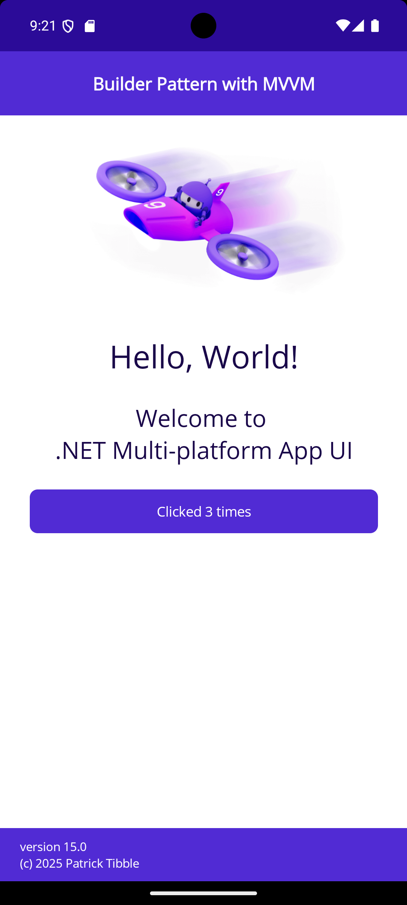

# Builder Pattern in MVVM
Demonstrates using a ViewModel Builder to compose UIs in MVVM

## The Parts of the Puzzle

### ViewModel Collection Builder

### View/ViewModel Map

### Base Buildable Page